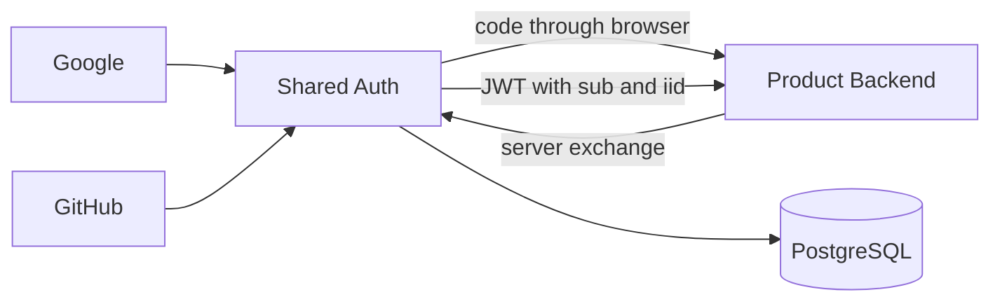
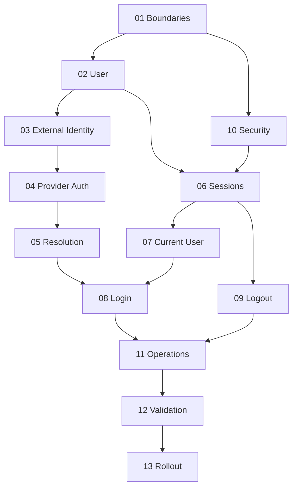

# Shared Authentication Specification Index

## TL;DR
- **Goal:** Build one small authentication service that gives first-party products one stable user identity across safely linked provider accounts.
- **Key decision:** Provider subject resolves first; a new identity may link to an existing user only through an exact verified canonical-email match.
- **Impact:** Google, GitHub, the shared auth service, and first-party products join one authentication flow.

## System boundary

## Purpose

This index defines build order, dependencies, milestones, and the gates between independently implementable specs.

## Scope

### In scope

| Item | Readiness | Basis / action |
|---|---|---|
| Shared identity and authentication | **Ready** | The required providers, identity boundary, and user flows are explicit. |
| Session lifetime | **Ready** | Sessions last 30 days and do not use sliding renewal. |
| First-party clients | **Ready** | PostgreSQL stores client credentials and approved redirect URIs. |
| Service contracts | **Ready** | The five `/auth` endpoints and client authentication rules are fixed below. |
| Session transport | **Ready** | The browser returns a single-use code; the product backend exchanges it server-to-server for a signed JWT. |

### Out of scope

- Product authorization, product data, passwords, MFA, enterprise identity, and public OAuth clients.
- Implementation in this planning change.

## Specification map

| Order | Spec | Purpose | Depends on | Gate before dependents |
|---:|---|---|---|---|
| 1 | [01 Domain and boundaries](01-domain-and-boundaries.md) | Fix ownership and trust boundaries | None | Ownership and first-party trust rules accepted |
| 2 | [02 User identity](02-user-identity.md) | Define the canonical user | 01 | Stable user invariant accepted |
| 3 | [03 External identities](03-external-identities.md) | Define provider identity links | 01, 02 | Provider-subject uniqueness accepted |
| 4 | [04 Provider authentication](04-provider-authentication.md) | Define trusted Google/GitHub proof | 01, 03 | Provider claims and request integrity accepted |
| 5 | [05 Identity resolution and linking](05-identity-resolution-and-linking.md) | Resolve login by provider subject | 02–04 | Existing and new provider subjects resolve deterministically |
| 6 | [06 Session management](06-session-management.md) | Define authenticated session lifecycle | 01, 02, 10 | Session security and expiry accepted |
| 7 | [07 Current user](07-current-user.md) | Expose minimal authenticated identity | 02, 06 | Response boundary and failure states accepted |
| 8 | [08 Login flows](08-login-flows.md) | Compose complete first/return login | 04–07 | Google and GitHub flows pass acceptance |
| 9 | [09 Logout flow](09-logout-flow.md) | End the current session safely | 06, 10 | Reuse after logout is rejected |
| 10 | [10 Security requirements](10-security-requirements.md) | Set cross-cutting security gates | 01 | Security gates pass for affected specs |
| 11 | [11 Observability and operations](11-observability-and-operations.md) | Make auth safe to run | 04–10 | Health, readiness, and structured logs are usable |
| 12 | [12 Testing and acceptance](12-testing-and-acceptance.md) | Validate the complete product behavior | 01–11 | Critical end-to-end cases pass |
| 13 | [13 Rollout plan](13-rollout-plan.md) | Release in controlled stages | 11, 12 | Each rollout gate passes |

## Dependency graph

## Recommended implementation sequence

1. Establish boundaries and the two identity records: 01–03.
2. Build provider proof, provider-subject resolution, and verified-email linking: 04–05.
3. Build authorization-code exchange, JWT sessions, and current-user lookup: 06–07 and relevant parts of 10.
4. Compose login and logout behavior: 08–09.
5. Add operational controls and complete validation: 10–12.
6. Roll out by provider and product: 13.

**Parallel work:** After 01, specs 02 and 10 can proceed together. After 05 and 06 are stable, 07 and provider-specific parts of 08 can proceed in parallel. Spec 11 can start once observable contracts in 04–10 stop changing.

## Milestones and acceptance gates

| Milestone | Specs | Acceptance before next milestone |
|---|---|---|
| M1 — Identity foundation | 01–03 | Each provider-subject identity owns one canonical user; product data is absent |
| M2 — Trusted resolution | 04–05, security subset | Exact provider identity wins; otherwise only a verified canonical-email match links the new identity |
| M3 — Authenticated access | 06–09 | Code exchange, current user, expiry, and immediate logout revocation work for both providers |
| M4 — Production readiness | 10–12 | PKCE, state, nonce, health, readiness, log, and end-to-end gates pass without secret leakage |
| M5 — Controlled adoption | 13 | Pilot then product rollout completes with rollback signals defined |

## Responsibilities

- Keep each dependent spec aligned with the invariants of its prerequisites.
- Treat acceptance criteria as the contract between independent implementation tasks.
- Revisit dependent specs when a foundational review decision changes.

## Explicit non-responsibilities

- This index does not choose code layout or API framework. PostgreSQL with a `pgx` pool is the required data store.
- It does not replace the acceptance criteria inside each spec.

## User or system behavior

- **Products:** Use JWT `sub` as the stable `user_id`; `iid` identifies the provider identity used for that session.
- **Auth service:** Answers who the user is and whether the current request is authenticated.
- **Providers:** Supply trusted external identity proof, not product authorization.

## Important edge cases

- A new provider identity links to the existing user when its verified email exactly matches the normalized canonical email.
- An absent or unverified email never links accounts and creates a new user.
- A product backend must keep the authorization code and JWT out of browser URLs after callback handling.
- Parallel tasks must not invent conflicting user, identity, or session contracts.

## Dependencies on other specifications

None. This file defines their relationship.

## Acceptance criteria

- Every requested capability maps to at least one spec and milestone.
- Each spec lists prerequisites and a pass/fail gate.
- The graph has no dependency cycle.
- Parallel work starts only after its shared prerequisite is accepted.

## Standard endpoints

| Endpoint | Contract |
|---|---|
| `GET /auth/login/:provider` | Starts OAuth for `client_id` and exact approved `redirect_uri`; preserves product `state` and requires PKCE. |
| `GET /auth/callback/:provider` | Validates the provider callback, resolves identity, creates a two-minute single-use code, and redirects to the approved product URI. |
| `POST /auth/exchange` | Authenticated product backend exchanges the code and PKCE verifier for a signed JWT and user profile. |
| `GET /auth/me` | Product backend presents the JWT and receives `user_id`, `identity_id`, and the shared profile. |
| `POST /auth/logout` | Authenticated product backend revokes the presented session in PostgreSQL before success. |

`/auth/exchange` and `/auth/logout` require either HTTP Basic client credentials or `X-Client-Id` and `X-Client-Secret`. Shared Auth verifies the secret against the client row. Mixing the two forms is rejected.

## Fixed platform decisions

- PostgreSQL is the only v1 store and is accessed through a `pgx` pool. Redis is not used.
- `users`, `clients`, `external_identities`, `sessions`, and `auth_codes` use UUIDv7 primary keys. JWT `sub` is `users.id`; JWT `iid` is `external_identities.id`.
- Sessions last 30 days. Authorization codes expire after two minutes and are single use.

## Intentionally deferred capabilities

- All items in the product-level out-of-scope list.
- User-driven link, unlink, merge, split, and account recovery flows. Automatic verified-email linking during login remains in scope.
- Provider access-token use after login.
- Global logout across every active session.
- Administrative user management and identity repair tools.
