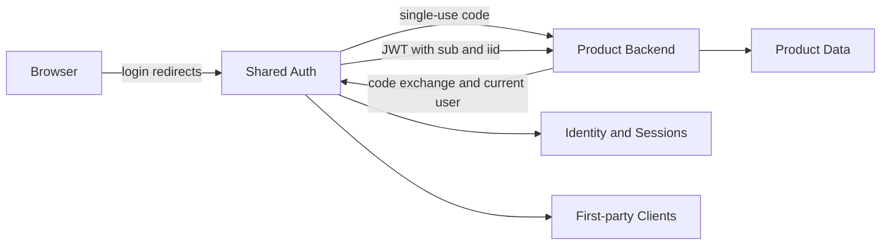

# Domain and Product Boundaries

## TL;DR
- **Goal:** Keep shared authentication small and product-neutral.
- **Key decision:** Shared Auth owns identity and session state; each product owns all authorization and business state.
- **Impact:** Products depend on one internal user ID but remain otherwise independent.

## Ownership boundary

## Purpose

Define the service mission, trust boundary, and ownership rules that all later specs must preserve.

## Scope

### In scope

| Item | Readiness | Basis / action |
|---|---|---|
| Identity and authentication boundary | **Ready** | The product goal limits the service to identity and login state. |
| First-party callers | **Ready** | All consuming products are owned and operated by one team. |
| Product callback boundary | **Ready** | Shared Auth returns a single-use code only to an approved product backend callback. |
| Client configuration | **Ready** | First-party clients and exact redirect URIs are stored in PostgreSQL. |
| Backend trust | **Ready** | Exchange and logout callers authenticate with client credentials. |

### Out of scope

- Roles, permissions, billing, plans, entitlements, onboarding, and product profile data.
- Third-party clients, developer integrations, consent, and public OAuth authorization.
- Organization, tenant, workspace, and enterprise identity features.

## Responsibilities

- Maintain canonical internal users and their provider identity links.
- Authenticate through Google and GitHub.
- Create, validate, expire, and revoke authenticated sessions.
- Return only shared identity fields to an authenticated first-party product.
- Restrict login returns to configured first-party backend callbacks.
- Exchange login codes and validate JWT sessions only over server-to-server calls.
- Authenticate `/auth/exchange` and `/auth/logout` with HTTP Basic or the `X-Client-Id` and `X-Client-Secret` header pair.

## Client contract

The PostgreSQL `clients` table is the source of truth for first-party integrations.

| Column | Contract |
|---|---|
| `id` | UUIDv7 primary key. |
| `client_id` | `VARCHAR(64)`, unique public identifier. |
| `client_secret_hash` | `VARCHAR(255)`; plaintext secrets are never stored. |
| `name` | `VARCHAR(255)`. |
| `redirect_uris` | `TEXT[]` collection of exact approved URIs. |
| `created_at`, `updated_at` | `TIMESTAMPTZ`. |

Redirect matching is exact. Client secrets are accepted only over TLS and stored as Argon2id hashes in `client_secret_hash`.

## Explicit non-responsibilities

- Decide what an authenticated user may do in a product.
- Store product membership, preferences, subscriptions, or onboarding state.
- Act as an identity provider for external parties.
- Keep provider credentials for calling unrelated provider APIs.

## User or system behavior

- **Two identity roles:** Products use JWT `sub` as their canonical `user_id`; `iid` records which linked provider identity authenticated the session.
- **Independent products:** Each product creates and owns any local record attached to that ID.
- **Authentication only:** A successful current-user lookup proves authentication, not permission.
- **Unknown product:** An unapproved callback or return target is rejected without redirecting sensitive state.
- **Browser boundary:** The browser never receives the Shared Auth JWT and does not call Shared Auth across origins.

## Important edge cases

- A valid session does not grant access when a product has disabled its local account.
- The same person may have product data in one product and none in another.
- A compromised or misconfigured product must not choose an arbitrary post-login destination.

## Dependencies on other specifications

None.

## Acceptance criteria

- The auth data model contains no product-specific fields.
- The current-user contract contains no role, permission, plan, or entitlement.
- Products can use one internal user ID without sharing their local data.
- Unapproved callback and return destinations are rejected.
- Shared parent-domain cookies, cross-site cookies, third-party cookies, and browser CORS are not required.
- Unknown, disabled, or invalid client credentials fail closed without revealing which credential was wrong.
