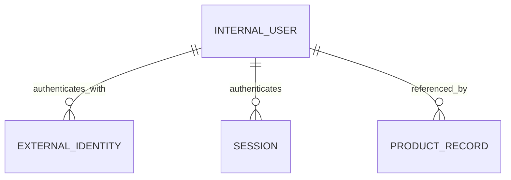

# Canonical User Identity

## TL;DR
- **Goal:** Give each resolved provider account one stable, product-neutral internal identity.
- **Key decision:** The immutable internal user ID is UUIDv7; a verified normalized canonical email is the only safe cross-provider linking key.
- **Impact:** Provider links and all first-party product records refer to this user ID; JWT `sub` carries it.

## Identity relationship

## Purpose

Define the minimal shared user record and invariants that prevent provider details from becoming the canonical product identity.

## Scope

### In scope

| Item | Readiness | Basis / action |
|---|---|---|
| Stable internal user ID | **Ready** | Required as the canonical downstream identity. |
| Shared profile | **Ready** | Limited to email, display name, and avatar. |
| Profile refresh policy | **Ready** | Verified claims may set canonical email; the current linked provider may refresh display name and avatar. |
| Identity format | **Ready** | Every user primary key is UUIDv7 and remains immutable. |

### Out of scope

- Product-specific profiles and user preferences.
- User profile editing, account deletion, and account recovery.
- Roles, status in a product, billing, and entitlements.

## Responsibilities

- Assign a UUIDv7 internal user ID once.
- Store only shared profile attributes needed by all products.
- Preserve referential identity even when email, name, or avatar changes.
- Record enough lifecycle time data to support audit and operations.

## Explicit non-responsibilities

- Treat email, provider subject, or session ID as the downstream canonical user ID.
- Guarantee that profile attributes are current outside a successful provider login.
- Model product account status or access.

## User or system behavior

- **Creation:** A new user receives one new immutable internal user ID.
- **Reuse:** The same linked provider and subject always resolve to that same ID.
- **Email:** Only a provider-verified email may populate the canonical email automatically.
- **Missing claims:** Display name and avatar may be absent without blocking authentication.
- **Provider change:** A new provider identity links to this user when its verified normalized email matches the canonical email.
- **Unverified email:** Never populates canonical email for linking and never selects an existing user.

## Important edge cases

- Providers may omit email, name, or avatar.
- A user may change their provider email while the provider subject stays stable.
- Multiple provider identities may share one internal user ID only through the verified-email rule in spec 05.
- Deleting a product-local record must not delete the shared user.

## Dependencies on other specifications

- [01 Domain and boundaries](01-domain-and-boundaries.md) defines what may be stored.

## Acceptance criteria

- Internal IDs are UUIDv7, unique, stable, and never reused.
- Profile fields are limited to internal ID, email, display name, avatar, and lifecycle metadata.
- A user may own multiple external identities after safe verified-email linking.
- JWT `sub` always identifies this canonical user, independent of which linked identity authenticated.
- Creating or updating a user cannot add product-specific data.
- A profile attribute change never changes the internal user ID.

## Fixed profile rules

- Store canonical email only from a verified provider claim, normalized by trimming surrounding space and lowercasing.
- Enforce uniqueness for non-null normalized canonical email so verified-email linking has one target.
- Keep canonical email stable when an existing linked identity later reports a different email. A new identity may link only to the stored canonical value.
- Refresh display name and avatar from the successfully authenticated linked identity when non-empty.
- A shared disabled-user state is outside v1; products still own local access decisions.
