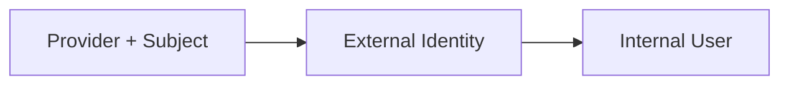

# External Login Identities

## TL;DR
- **Goal:** Represent Google and GitHub accounts as login identities linked to internal users.
- **Key decision:** Provider plus subject is authoritative for returning login; verified email may link only a previously unseen identity.
- **Impact:** Returning login works even when provider profile fields change, and JWT `iid` records the exact identity used.

## Provider identity key

## Purpose

Define provider-independent identity data and invariants for Google and GitHub.

## Scope

### In scope

| Item | Readiness | Basis / action |
|---|---|---|
| Google and GitHub identities | **Ready** | Both are required initial providers. |
| Provider-independent identity concept | **Ready** | A common contract avoids changing product behavior per provider. |
| Stored claim snapshot | **Ready** | Keep the latest subject, email, verification state, and minimal profile values for the life of the link. |
| Identity format | **Ready** | Every external identity primary key is UUIDv7. |

### Out of scope

- Provider access tokens after authentication is complete.
- Provider API access unrelated to login.
- User-driven link, unlink, split, merge, and arbitrary provider plug-in frameworks.

## Responsibilities

- Identify an external account by provider name and stable provider subject.
- Enforce that one provider identity links to exactly one internal user.
- Allow multiple provider identities to reference one user after verified-email linking.
- Preserve the link when provider email, display name, or avatar changes.
- Distinguish verified, unverified, and absent provider email claims.

## Explicit non-responsibilities

- Use email as the external identity primary key or override an existing provider-subject link.
- Link from absent or unverified email claims.
- Store passwords or long-lived provider credentials.

## User or system behavior

- **Already linked:** The same provider and subject always resolve to the existing user.
- **New subject with matching verified email:** Link the identity to the user with that canonical email.
- **Other new subject:** Create a UUIDv7 user and link the UUIDv7 external identity to it.
- **Changed profile:** Mutable claims may refresh safely without moving the identity to another user.
- **Provider isolation:** Equal subject strings from different providers are distinct identities.
- **Uniqueness conflict:** A link request that violates provider-subject uniqueness fails closed.

## Important edge cases

- GitHub may not supply a usable email unless the trusted flow obtains a verified one.
- A provider can recycle an email; provider subject remains authoritative.
- A provider identity already linked to user A must never be relinked to user B during login.
- Equal verified emails across new identities converge on the canonical user's UUIDv7 ID.

## Dependencies on other specifications

- [01 Domain and boundaries](01-domain-and-boundaries.md).
- [02 User identity](02-user-identity.md).

## Acceptance criteria

- Provider plus subject is unique across identity records.
- Every external identity references exactly one internal user once linked.
- A user may have one or more external identities.
- A session JWT carries the authenticated external identity UUID as `iid` and its owner as `sub`.
- Only a verified normalized email matching a canonical user email can trigger automatic linking.
- Adding another provider does not change the internal user contract.

## Fixed representation

- `external_identities.id` is UUIDv7 and `user_id` references `users.id`.
- JWT `iid` is `external_identities.id`; JWT `sub` is the linked `users.id`.
- Provider is a constrained string with v1 values `google` and `github`.
- `(provider, provider_subject)` is unique and never changes ownership during login.
- Claim snapshots remain while the identity link exists. Canonical matching uses trimmed, lowercased verified email.
