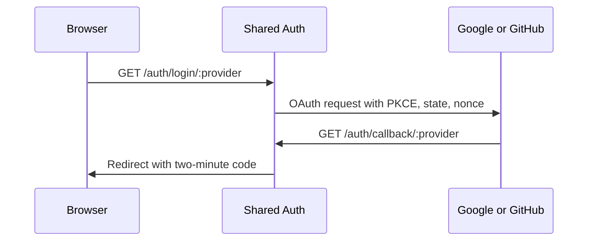

# Provider Authentication

## TL;DR
- **Goal:** Accept trusted Google and GitHub login proof through one product behavior.
- **Key decision:** Shared Auth validates provider responses and binds them to the initiating login request.
- **Impact:** Provider differences stop at the authentication boundary.

## Trust flow

## Purpose

Define observable provider authentication guarantees before identity resolution occurs.

## Scope

### In scope

| Item | Readiness | Basis / action |
|---|---|---|
| Google authentication | **Ready** | Required provider. |
| GitHub authentication | **Ready** | Required provider. |
| Request integrity and trusted claim validation | **Ready** | Required for secure login. |
| Provider account email retrieval | **Ready** | Request the minimum scope needed to obtain provider-verified email for safe linking and profile display. |

### Out of scope

- Passing provider tokens to products.
- Calling provider services after login for product features.
- Generic provider SDK or unlimited provider configuration.

## Responsibilities

- Start authentication only for a supported provider and approved product return target.
- Bind the callback to the initiating login using OAuth PKCE, cryptographic state, and nonce validation.
- Validate proof through the provider's trusted mechanism, including issuer, audience/client, signature where applicable, and expiry.
- Produce a normalized claim set: provider, subject, email, email verification, display name, and avatar.

## Explicit non-responsibilities

- Resolve internal users; spec 05 owns provider-subject resolution and verified-email linking.
- Treat provider success alone as an application session.
- Retain provider authorization material beyond the time needed to finish login.

## User or system behavior

- **Valid callback:** Yields one trusted normalized external identity claim set and permits a product authorization code to be issued.
- **Denied login:** Returns a safe authentication failure and creates no user or session.
- **Invalid callback:** Creates no identity link, user, or session.
- **Missing optional profile:** Authentication can continue when the provider subject is valid.
- **Unsupported provider:** Fails before leaving Shared Auth.

## Important edge cases

- Callback replay, PKCE failure, state mismatch, nonce mismatch, expired proof, wrong audience, and provider outage.
- GitHub email absent, private, or unverified.
- Multiple GitHub emails: only the provider-marked primary verified email may participate in canonical-email linking.
- User opens more than one login flow in parallel.

## Dependencies on other specifications

- [01 Domain and boundaries](01-domain-and-boundaries.md).
- [03 External identities](03-external-identities.md).
- [10 Security requirements](10-security-requirements.md) supplies mandatory controls.

## Acceptance criteria

- Both providers produce the same normalized claim categories.
- Forged, expired, PKCE-invalid, state-invalid, nonce-invalid, or replayed callbacks fail without state changes.
- Requested scopes are limited to authentication and basic profile needs.
- Provider secrets and transient credentials never reach products or logs.

## Fixed protocol rules

- Start OAuth at `GET /auth/login/:provider` and receive it at `GET /auth/callback/:provider`.
- Login attempts expire after 10 minutes. State and nonce are single use.
- PKCE uses `S256`.
- Google email is trusted only when the validated claim marks it verified. GitHub uses its authenticated email API with the minimum email scope and selects only a primary verified address.
- Provider libraries are an implementation choice but must enforce these contracts.
