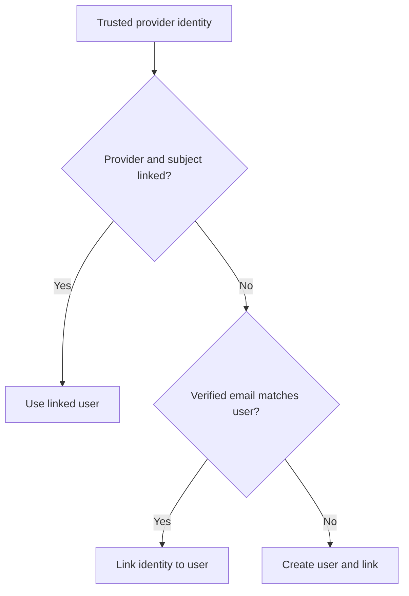

# Identity Resolution and Linking

## TL;DR
- **Goal:** Resolve trusted provider login without duplicating accounts that share a verified email.
- **Key decision:** `(provider, provider_subject)` wins first; only a new identity with verified email may link to a canonical-email match.
- **Impact:** The same verified person can use multiple providers while unverified email remains isolated.

## Resolution decision

## Purpose

Define strict rules that convert trusted provider claims into a canonical internal user.

## Scope

### In scope

| Item | Readiness | Basis / action |
|---|---|---|
| Returning identity resolution | **Ready** | Provider plus subject is authoritative. |
| New provider-subject resolution | **Ready** | Check a verified canonical-email match before creating a user. |
| Safe automatic linking | **Ready** | Only present and verified normalized email may select an existing user. |
| Concurrent first login | **Ready** | Must preserve one identity link and avoid duplicate users. |

### Out of scope

- User-driven link, unlink, merge, transfer, or account recovery.
- Staff repair tools and bulk deduplication.
- Linking from unverified email, display name, avatar, or other profile claims.

## Responsibilities

- Resolve an already-linked provider identity to its existing user.
- For a new provider identity, link it to an existing canonical-email match only when the provider email is present and verified.
- Otherwise create a UUIDv7 user and a UUIDv7 identity link.
- Make user creation and identity linking one consistent outcome under concurrent requests.

## Explicit non-responsibilities

- Merge two existing internal user rows during login; this flow links only a new external identity to one existing user.
- Move an external identity between users.
- Guess identity from name, avatar, email domain, or unverified email.

## User or system behavior

- **Already linked:** Use the linked user even if current provider email differs.
- **New subject and verified match:** Link the new identity to the existing user and return that user's UUIDv7 ID.
- **New subject without verified match:** Create one new UUIDv7 user, link the identity, and return that user.
- **Unverified or absent email:** Never auto-link; create a new user.
- **Existing-link claim conflict:** Keep the provider-subject owner authoritative; do not move the identity based on current email claims.
- **Link uniqueness conflict:** Preserve all existing links and create no session.

> **Warning**
> Never use an unverified or absent email, or a mutable profile field, to link accounts.

## Important edge cases

- Two requests attempt first login for the same provider subject at once.
- Concurrent new providers submit the same verified email.
- An already-linked provider identity returns an email that matches a different user.
- A provider email changes after the exact provider identity was linked; the existing owner still wins.

## Dependencies on other specifications

- [02 User identity](02-user-identity.md).
- [03 External identities](03-external-identities.md).
- [04 Provider authentication](04-provider-authentication.md).
- Relevant controls in [10 Security requirements](10-security-requirements.md).

## Acceptance criteria

- Repeated Google or GitHub login never creates a duplicate user for the same provider subject.
- A login from an unlinked provider joins the existing user when verified email matches its canonical email.
- Unverified or absent email cannot automatically link, merge, or select a user.
- Concurrent equivalent first logins converge on one external identity and one user outcome.
- Concurrent first logins with one verified canonical email converge on one user.

## Fixed transaction rules

1. Lookup by unique `(provider, provider_subject)` and return its user when present.
2. For a new identity with present, verified email, normalize it and lookup `users.canonical_email`.
3. Link the new UUIDv7 external identity to that user when found.
4. Otherwise create a UUIDv7 user and link the new identity in the same PostgreSQL transaction.

Unique `(provider, provider_subject)` and non-null normalized canonical-email constraints, plus transaction retry, must make concurrent requests converge. User-driven link, unlink, split, and repair remain outside v1.
