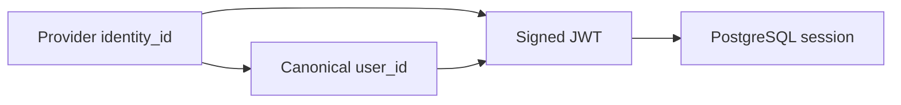

# Authenticated Session Management

## TL;DR
- **Goal:** Keep a resolved user authenticated for 30 days.
- **Key decision:** JWT `sub` identifies the canonical user and `iid` identifies the exact provider identity; PostgreSQL session state remains authoritative for expiry and revocation.
- **Impact:** Code exchange, current-user lookup, and logout share one immediately revocable session lifecycle.

## Identity carried by a session



## Contract changes

The JWT contains these identity and validation claims:

| Claim | Contract |
|---|---|
| `sub` | Canonical `users.id`. |
| `iid` | `external_identities.id` used for this login. |
| `sid` | UUIDv7 session ID. |
| `iss`, `aud` | Shared Auth issuer and authenticated product `client_id`. |
| `iat`, `exp` | Issue time and fixed 30-day expiry. |

Email, profile fields, roles, permissions, plans, and entitlements do not appear in the JWT.

Example JOSE header:

```json
{
  "alg": "ES256",
  "typ": "JWT",
  "kid": "auth-signing-2026-10"
}
```

Example decoded payload:

```json
{
  "iss": "https://auth.example.com",
  "aud": "product-web",
  "sub": "0199f3a2-7b51-7d12-8c41-1f6cd88f0101",
  "iid": "0199f3a2-8aa4-76ec-a221-38b7fe2c0202",
  "sid": "0199f3a2-93d8-778d-9a22-715b883d0303",
  "iat": 1791244800,
  "exp": 1793836800
}
```

## Scope

### In scope

| Item | Readiness | Basis / action |
|---|---|---|
| JWT creation and validation | **Ready** | Required after successful code exchange. |
| User and login identity claims | **Ready** | `sub` carries `user_id`; `iid` carries the provider `identity_id`. |
| Expiry and logout revocation | **Ready** | PostgreSQL session state remains authoritative. |
| Fixed lifetime | **Ready** | Each session lasts 30 days without sliding renewal. |
| Identity format | **Ready** | User, identity, session, and authorization-code IDs are UUIDv7. |

### Out of scope

- Device inventory, session management UI, and device audit.
- Global logout from every device.
- Refresh tokens, JWT product authorization claims, and Redis-backed session storage.

## Review decisions

| Decision | Why | Consequence |
|---|---|---|
| JWT `sub` carries `user_id` | The user is the stable principal shared by products. | Products key local data by `sub`, never by `iid`. |
| JWT `iid` carries `identity_id` | Audit and security logic must know which provider identity authenticated. | Switching provider changes `iid` but may keep the same `sub`. |
| PostgreSQL validates `sid` | Logout must take effect immediately. | Signature validation alone is not proof of an active session. |
| ES256 signs JWTs | An asymmetric key limits signing authority to Shared Auth and supports controlled rotation through `kid`. | Validators must reject every other algorithm. |

## Behavior

- **Successful exchange:** Creates one active session and returns a signed JWT to the authenticated product backend.
- **Active session:** Requires valid JWT signature, issuer, audience, time claims, identity claims, and an active matching PostgreSQL session.
- **Claim binding:** The session row's `user_id`, `identity_id`, client, and expiry must match `sub`, `iid`, `aud`, and `exp`.
- **Expired or revoked session:** Behaves as unauthenticated and cannot be revived by reusing the JWT.
- **Logout:** Revokes the `sid`; retaining the signed JWT does not preserve access.
- **Repeated login:** May create another session but does not change the resolved `user_id` or identity ownership.

> **Warning**
> Products must not treat decoded claims or a valid signature alone as proof that the session is active. Shared Auth session validation is authoritative.

## Impact

- **Products:** Receive `sub` and `iid` in the JWT. Product data and authorization use `sub` as the canonical `user_id`.
- **Data:** Each session references one user, one external identity, and one client. No plaintext token or token hash is stored.
- **Operations:** Signing keys require protected storage and controlled rotation. JWTs and signing keys must never enter logs.

## Edge cases

- A valid JWT contains an `iid` that does not belong to `sub`.
- A JWT audience differs from the product presenting it.
- Two tabs share a session while one logs out.
- Signing-key rotation occurs while active JWTs still exist.

## Dependencies on other specifications

- [01 Domain and boundaries](01-domain-and-boundaries.md).
- [02 User identity](02-user-identity.md).
- [03 External identities](03-external-identities.md).
- [10 Security requirements](10-security-requirements.md).

## Acceptance criteria

- A valid active session resolves exactly one `user_id` and one linked `identity_id`.
- Altered, expired, wrong-issuer, wrong-audience, revoked, or claim-mismatched JWTs return unauthenticated.
- Logout invalidation is effective even when a caller retains the JWT.
- JWT claims contain no product authorization or mutable profile data.
- PostgreSQL contains session metadata but no JWT value or signing key.

## Fixed persistence rules

- `sessions.id` and `auth_codes.id` are UUIDv7 primary keys.
- A session stores `user_id`, `identity_id`, `client_id`, expiry, revocation state, and lifecycle metadata.
- Authorization codes expire exactly two minutes after issue and become unusable after the first successful exchange.
- Session expiry uses PostgreSQL time. Product-local cookie settings remain outside Shared Auth.
