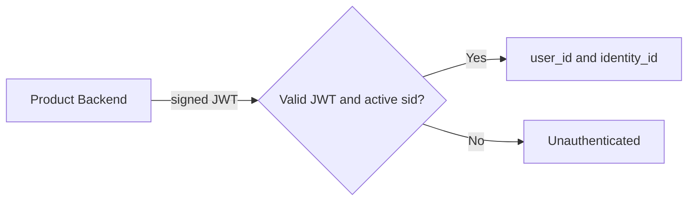

# Current Authenticated User

## TL;DR
- **Goal:** Let first-party product backends resolve an active JWT session.
- **Key decision:** The response contains canonical `user_id`, authenticated `identity_id`, and shared profile fields.
- **Impact:** Products can attach independent local data without coupling Shared Auth to it.

## Lookup boundary

## Purpose

Define the minimal current-user capability and its authentication semantics.

## Scope

### In scope

| Item | Readiness | Basis / action |
|---|---|---|
| Current-user lookup | **Ready** | Required core capability. |
| Minimal shared profile response | **Ready** | Fields are explicit in the product goal. |
| Unauthenticated response | **Ready** | Must be distinct and predictable. |

### Out of scope

- Product roles, permissions, plans, subscriptions, entitlements, and onboarding state.
- Provider tokens and full provider profiles.
- Searching or listing users.

## Responsibilities

- Validate the JWT signature, registered claims, identity binding, and active PostgreSQL session before returning user data.
- Return `user_id`, `identity_id`, email, display name, and avatar only.
- Use a stable unauthenticated result for missing, invalid, expired, or revoked sessions.
- Prevent one caller from selecting an arbitrary user ID to inspect.

## Explicit non-responsibilities

- Decide whether the user may enter or use a product.
- Create product-local user records.
- Return all linked provider identities unless a later reviewed requirement adds it.

## User or system behavior

- **Authenticated server request:** `GET /auth/me` with the JWT returns the session's user, authenticated identity, and shared profile.
- **No valid session:** Returns unauthenticated and no user profile.
- **Profile gaps:** Nullable email, display name, or avatar do not change authentication status.
- **Product decision:** The product uses the internal ID to load its own record and authorization state.

## Important edge cases

- User profile fields change between two lookups.
- Session expires during a request; validation uses one consistent decision point.
- A product has no local record for a valid internal user.
- A browser attempts to call `/me` directly; the supported boundary is the product backend.

## Dependencies on other specifications

- [02 User identity](02-user-identity.md).
- [06 Session management](06-session-management.md).
- [10 Security requirements](10-security-requirements.md).

## Acceptance criteria

- A valid token for the same provider identity returns the same internal user ID across first-party products.
- The response exposes only `user_id`, `identity_id`, email, display name, and avatar.
- Missing, invalid, expired, and revoked sessions return no identity.
- Product authorization fields cannot appear in the contract.
- The caller cannot query another user by changing request input.

## Endpoint contract

- `GET /auth/me` is server-to-server and accepts the JWT as `Authorization: Bearer <token>`.
- A valid session returns `200` with `user_id`, `identity_id`, `email`, `display_name`, and `avatar_url`.
- Missing, invalid, expired, or revoked tokens return `401` with no profile.
- Every response uses `Cache-Control: no-store`.
