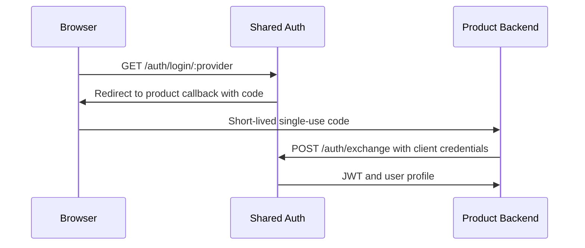

# Complete Login Flows

## TL;DR
- **Goal:** Compose provider proof, identity resolution, session creation, and safe return into one login experience.
- **Key decision:** Shared Auth returns a short-lived, single-use authorization code; only the product backend can exchange it for a signed JWT containing `sub` and `iid`.
- **Impact:** Google and GitHub use one flow without session tokens in URLs or cross-site browser session sharing.

## Login outcome

## Purpose

Define the complete user-facing behavior for first-time and returning login across both providers.

## Scope

### In scope

| Item | Readiness | Basis / action |
|---|---|---|
| First-time Google and GitHub login | **Ready** | Required success cases. |
| Returning Google and GitHub login | **Ready** | Required success cases. |
| Approved product return | **Ready** | Required to complete login safely. |
| Authorization-code exchange | **Ready** | Code lifetime is two minutes, single-use, and bound to the client and approved redirect URI. |
| Error presentation | **Ready** | Return a stable non-sensitive error code to the initiating product. |

### Out of scope

- Password, MFA, passkey, and enterprise login.
- Provider account chooser behavior controlled by Google or GitHub.
- Product authorization after authentication.

## Responsibilities

- Compose specs 04–07 without weakening any prerequisite.
- Ensure failed login does not leave partial users, links, or sessions.
- Preserve the approved return destination across the flow without trusting a callback-supplied redirect.
- Put only the short-lived authorization code in the product callback URL and reject expired or reused codes.
- Return JWTs only through an authenticated server-to-server exchange.
- Give products a stable success or safe failure outcome.

## Explicit non-responsibilities

- Grant product access or create product business records.
- Link accounts from unverified email or mutable profile claims.
- Expose provider failure details, credentials, or identity claims to the browser URL.
- Require shared parent-domain cookies, cross-site cookies, third-party cookies, or browser CORS.

## User or system behavior

- **New user:** A valid unseen provider subject without a verified canonical-email match creates one user and one link, then permits one code exchange for a session.
- **Returning user:** A linked provider subject reuses its user and permits one code exchange for a new session.
- **Unlinked second provider:** Links to the existing user when its verified email matches canonical email; otherwise creates a user.
- **Product session:** The product may create its own local session cookie or retain the JWT server-side and call `/me`.
- **Provider failure:** The user returns safely with no authenticated state created.
- **Cross-product use:** Later login with the same provider account from another product resolves the same internal user.

## Important edge cases

- The user cancels at the provider.
- The login attempt expires before callback.
- The product code expires after two minutes or is exchanged twice.
- Multiple product tabs begin different provider logins.
- Persistence succeeds only in part; the observable result must still be all-or-nothing.
- The saved return target is no longer approved when callback arrives.

## Dependencies on other specifications

- [04 Provider authentication](04-provider-authentication.md).
- [05 Identity resolution and linking](05-identity-resolution-and-linking.md).
- [06 Session management](06-session-management.md).
- [07 Current user](07-current-user.md).
- [10 Security requirements](10-security-requirements.md).

## Acceptance criteria

- New and returning flows pass for Google and GitHub.
- Returning login never duplicates the internal user.
- A verified-email second-provider login returns the existing internal user ID; an unverified one returns a new ID.
- Every failure path creates no usable session and reveals no sensitive details.
- Success returns only to an approved first-party destination.
- Session tokens never appear in browser URLs.

## Endpoint contracts

- `GET /auth/login/:provider` requires `client_id`, exact `redirect_uri`, product `state`, `code_challenge`, and `code_challenge_method=S256`.
- `GET /auth/callback/:provider` validates OAuth state and provider proof, creates a two-minute single-use code, then redirects with `code` and the original product `state`.
- `POST /auth/exchange` requires client authentication plus `code`, `code_verifier`, and the same `redirect_uri`; success returns a 30-day signed JWT with `sub` and `iid`, plus the shared user profile.
- Client authentication uses HTTP Basic or `X-Client-Id` and `X-Client-Secret`; mixed or invalid forms fail with `401`.
- Browser redirects expose only stable error categories: `access_denied`, `invalid_request`, `expired_request`, or `temporarily_unavailable`.
