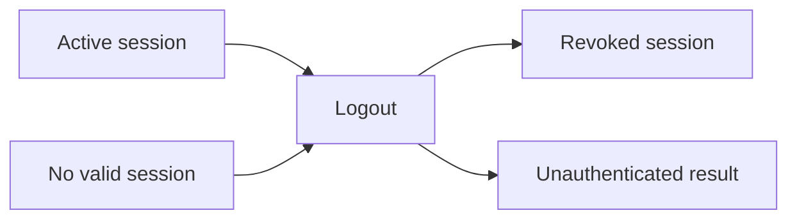

# Logout Flow

## TL;DR
- **Goal:** End the current Shared Auth session safely and predictably.
- **Key decision:** Logout immediately revokes the JWT's `sid` in PostgreSQL and is safe to repeat.
- **Impact:** Products can reliably return the browser to an unauthenticated state.

## Logout state change

## Purpose

Define logout semantics, including PostgreSQL revocation and product-local browser cleanup.

## Scope

### In scope

| Item | Readiness | Basis / action |
|---|---|---|
| Current-session logout | **Ready** | Required capability. |
| Idempotent unauthenticated result | **Ready** | Supports retries and stale clients safely. |
| Backend authentication | **Ready** | The product authenticates with client credentials before revocation. |

### Out of scope

- Global logout across all sessions or devices.
- Revoking the user's Google or GitHub login at the provider.
- Deleting the user, provider links, or product data.

## Responsibilities

- Revoke the presented session when it is valid.
- Require the product to clear its local browser session state regardless of prior session validity.
- Return a stable successful unauthenticated outcome when logout is repeated.
- Accept logout from the trusted product backend, not from a cross-origin browser call.

## Explicit non-responsibilities

- Revoke unrelated sessions.
- Sign the user out of Google or GitHub.
- Change identity links or user profile fields.

## User or system behavior

- **Active session:** Revoke the session row identified by JWT `sid` so the token is unusable immediately.
- **Missing or stale session:** Logout remains idempotent; the product still clears its local client state.
- **Repeated logout:** Has no additional side effect and remains safe.
- **After logout:** Current-user lookup returns unauthenticated for the revoked session.
- **Response:** Returns `204` after revocation; browser navigation remains the product's responsibility.

## Important edge cases

- Two tabs share a session and one logs out.
- The revocation store is temporarily unavailable.
- A forged or untrusted backend request attempts to log a user out.
- A caller supplies an external post-logout URL.

## Dependencies on other specifications

- [06 Session management](06-session-management.md).
- [10 Security requirements](10-security-requirements.md).
- [01 Domain and boundaries](01-domain-and-boundaries.md) for approved products.

## Acceptance criteria

- A logged-out session cannot retrieve the current user.
- PostgreSQL shows the session deleted or invalid before logout reports success.
- Repeating logout is safe and ends unauthenticated.
- Logout never deletes users or identity links.
- Invalid client credentials are rejected before session state changes.
- Failure to ensure revocation does not report a misleading successful authenticated-state transition.

## Endpoint contract

- `POST /auth/logout` is server-to-server and requires HTTP Basic or `X-Client-Id` and `X-Client-Secret` client authentication plus the bearer JWT.
- Valid, missing, stale, or already revoked JWT sessions return `204` after the revocation check, preserving idempotency.
- PostgreSQL failure returns `503`; the endpoint must not claim successful revocation.
- The product always clears its local browser session. Shared Auth does not redirect after logout.
