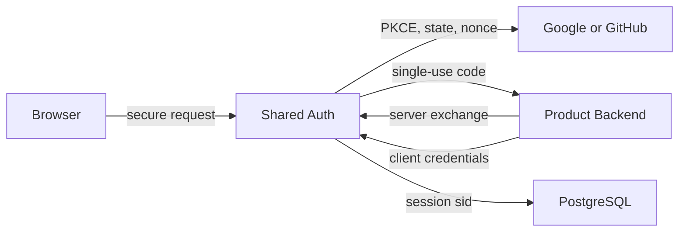

# Security Requirements

## TL;DR
- **Goal:** Protect login, identity links, and sessions with the minimum controls required for this service.
- **Key decision:** OAuth PKCE, cryptographic state, and nonce validation protect login integrity and replay; session tokens stay off browser URLs.
- **Impact:** All provider, linking, session, current-user, and logout work has security acceptance gates.

## Security boundaries

## Purpose

Define focused security invariants needed to prevent forged login, replay, session theft, secret exposure, and unsafe identity merging.

## Scope

### In scope

| Item | Readiness | Basis / action |
|---|---|---|
| Provider proof validation | **Ready** | Required to trust external identity. |
| Login integrity and replay defense | **Ready** | Required for callback safety. |
| Session and logout protection | **Ready** | Required for authenticated state. |
| Secret and log hygiene | **Ready** | Required for production operation. |

### Out of scope

- MFA, device trust, risk scoring, advanced fraud detection, and enterprise security policy.
- Product authorization and security decisions based on product state.
- A general secrets platform or security analytics product.
- Dedicated IP or endpoint rate-limiting middleware and infrastructure for v1.

## Responsibilities

- Validate provider issuer, audience/client binding, signature or direct exchange authenticity, expiry, and stable subject.
- Bind callbacks to an unguessable, single-use, short-lived login attempt and its approved return target using PKCE, cryptographic state, and nonce validation.
- Prevent session forgery, fixation, disclosure, and use after expiry or revocation.
- Bind signed JWT `sub`, `iid`, `aud`, `sid`, and `exp` to the same active PostgreSQL session.
- Keep session tokens out of browser URLs and return them only through the product backend's server-to-server code exchange.
- Protect provider credentials, signing or encryption keys, and session secrets in approved secret storage.
- Redact tokens, codes, session material, cookies, secrets, and full provider payloads from logs.
- Resolve provider subject first and permit automatic linking only from a present, provider-verified canonical-email match.
- Verify `/auth/exchange` and `/auth/logout` callers against hashed credentials in `clients`.

## Explicit non-responsibilities

- Detect sophisticated account takeover through behavioral analysis.
- Define a shared role or permission model.
- Store or inspect product business data for security decisions.

## User or system behavior

- **Forged or replayed login:** Fails with no user, link, or session mutation.
- **Session rotation:** Successful authentication does not preserve attacker-supplied session identity.
- **Invalid session:** Returns unauthenticated without revealing why validation failed.
- **Logout:** Requires state-change protection and makes the current session unusable.
- **Production traffic:** Uses authenticated, encrypted transport end to end at the exposed boundary.
- **Secret failure:** Missing or invalid production secret configuration prevents unsafe startup or provider use.

## Important edge cases

- Multiple valid login attempts from separate tabs must not make state reusable.
- JWT signing-key or provider-secret rotation must not create an unbounded acceptance window.
- Proxy headers and approved callback checks must not trust arbitrary client input.
- Error reporting must distinguish operations internally without leaking credentials or account existence externally.

## Dependencies on other specifications

- [01 Domain and boundaries](01-domain-and-boundaries.md) defines trusted callers and return targets.
- Specs [04](04-provider-authentication.md), [05](05-identity-resolution-and-linking.md), [06](06-session-management.md), [07](07-current-user.md), [08](08-login-flows.md), and [09](09-logout-flow.md) must satisfy these controls.

## Acceptance criteria

- Altered, expired, reused, wrong-client, and wrong-issuer provider results are rejected.
- Login state cannot be guessed, changed, reused, or redirected to an unapproved destination.
- PKCE, cryptographic state, and nonce failures stop login without state mutation.
- Session material is absent from URLs, response logs, application logs, and error details.
- Expired and revoked sessions fail server-side validation.
- A JWT with altered identity claims, mismatched audience, or an `iid` not linked to `sub` fails closed.
- Production endpoints reject insecure transport at the effective external boundary.
- Verified canonical-email matches may link only a new provider identity; unverified email never links.
- Secrets are injected outside source and are not emitted during startup or failures.

## Fixed controls

- OAuth state and nonce contain at least 128 bits of cryptographic randomness, expire with the 10-minute login attempt, and are single use.
- PKCE uses `S256`; plain PKCE is rejected.
- Provider and client secrets come from approved secret storage, support overlap during controlled rotation, and never enter source or logs.
- Only configured proxy hops may supply forwarded scheme or client-address headers; all other forwarded values are ignored.
- Client secrets are stored only as Argon2id hashes and compared through the verifier without exposing timing or error detail.
- JWT validation pins `ES256`, requires `iss`, `aud`, `sub`, `iid`, `sid`, `iat`, and `exp`, and rejects unknown `kid` values or any other algorithm.
- Product-local cookie protections remain owned by each product backend.
