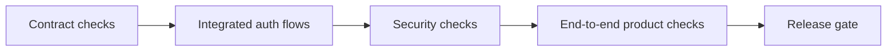

# End-to-End Validation and Acceptance

## TL;DR
- **Goal:** Prove every required auth flow and safety invariant before rollout.
- **Key decision:** Acceptance uses observable contracts and real provider-compatible flows, not internal code shape.
- **Impact:** Each milestone has an independent pass/fail gate and the full system has one release gate.

## Validation layers

## Purpose

Define the validation matrix that demonstrates product correctness, security, and cross-product identity reuse.

## Scope

### In scope

| Item | Readiness | Basis / action |
|---|---|---|
| Required success journeys | **Ready** | The accepted provider, identity, transport, session, security, and operations outcomes are explicit. |
| Failure and race validation | **Ready** | Needed for identity and session integrity. |
| Provider-compatible pre-production checks | **Ready** | Needed to validate real provider behavior. |
| Performance targets | **Ready** | Numeric latency and load targets are outside v1; the pilot records a baseline without weakening correctness gates. |

### Out of scope

- Product authorization tests.
- Enterprise identity, passwords, MFA, billing, and other deferred features.
- Prescribing a test framework or test file layout.

## Responsibilities

- Validate each spec's acceptance criteria before dependent work is accepted.
- Cover normal, denied, invalid, expired, replayed, concurrent, and dependency-failure outcomes.
- Verify no partial user, link, or session state remains after failed login.
- Verify the same provider subject yields the same internal user ID across first-party products.
- Keep provider sandbox or controlled account data separate from production user data.

## Explicit non-responsibilities

- Validate product-local permission or onboarding behavior.
- Depend only on provider mocks for the release gate.
- Assert internal function layout or storage choices beyond the accepted PostgreSQL and `pgx` contracts.

## User or system behavior

- **Google new/returning:** Both journeys authenticate and reuse one stable user.
- **GitHub new/returning:** Both journeys authenticate and reuse one stable user.
- **Verified-email linking:** A new provider identity with matching verified canonical email reuses the existing UUIDv7 user ID.
- **Unverified isolation:** An absent or unverified email creates a new UUIDv7 user and never links automatically.
- **Session lifecycle:** Two-minute single-use code exchange, JWT creation, `/auth/me`, 30-day expiry, and immediate PostgreSQL `sid` revocation behave as specified.
- **Client authentication:** Exchange and logout accept either supported credential form and reject mixed, missing, or invalid credentials.
- **Shared identity:** Two products observe the same internal user ID and keep independent local state.
- **JWT identity:** `sub` is the canonical `user_id`; `iid` is the linked `identity_id` used for provider login.
- **Boundary:** No current-user response or session carries product authorization.

## Important edge cases

- Concurrent first login for the same provider subject.
- Concurrent first login from two providers with the same verified email.
- Provider email changes after linking.
- Authorization code expiry, reuse, wrong product, and session-token URL leakage.
- Missing GitHub email and missing optional profile fields.
- Login replay, wrong audience, altered state, revoked session, and unapproved redirect.
- Altered JWT claims, mismatched `sub` and `iid`, and valid signature with revoked `sid`.
- Provider, identity store, or session store becomes unavailable mid-flow.

## Dependencies on other specifications

- All functional and security specs, 01–11.

## Acceptance criteria

- All acceptance outcomes in this specification set pass.
- Each spec's acceptance criteria has an automated or repeatable verification path.
- Security-negative cases cause no identity or session mutation.
- Concurrent logins for the same provider and subject converge without duplicate external identities or internal users.
- Concurrent new-provider logins for one verified canonical email converge on one internal user.
- All five standard endpoints satisfy their method, path, authentication, expiry, and response contracts.
- Provider-compatible checks pass for both Google and GitHub before production enablement.
- Structured JSON logs from validation contain no prohibited authentication material and include the required fields.
- `/health` and `/ready` return the expected state during healthy and failed dependency cases.

## Fixed validation approach

- Use team-controlled Google and GitHub staging accounts and exact HTTPS redirect URIs registered to staging client rows.
- Automate contract, integration, concurrency, expiry, and security-negative checks. Manually verify each provider's real consent and callback flow before production enablement.
- Record pilot latency and availability as the future baseline; v1 has no numeric performance promotion threshold.
- Validate PostgreSQL through the configured `pgx` pool and confirm Redis is not required.

## Acceptance traceability

| Product outcome | Primary specs |
|---|---|
| New and returning Google/GitHub login | 04, 05, 08 |
| Stable internal user and provider mapping | 02, 03, 05 |
| Provider-subject identity and verified-email linking | 05, 10 |
| Code exchange, JWT session, expiry, current user, logout | 06–09 |
| Shared identity across products | 01, 07, 08 |
| Auth versus authorization boundary | 01, 02, 07 |
