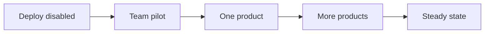

# Rollout Plan

## TL;DR
- **Goal:** Introduce Shared Auth in small stages with clear stop and rollback gates.
- **Key decision:** Enable providers and products gradually after production-safe validation.
- **Impact:** Existing products adopt the canonical internal user ID without moving authorization into Shared Auth.

## Rollout stages

## Purpose

Define a controlled release sequence that limits identity, session, and product-integration risk.

## Scope

### In scope

| Item | Readiness | Basis / action |
|---|---|---|
| Staged provider and product enablement | **Ready** | Reduces blast radius and isolates failures. |
| Rollback and stop signals | **Ready** | Auth failure must not spread across products. |
| Greenfield deployment | **Ready** | No auth users, sessions, clients, or product identity data require migration or backfill. |

### Out of scope

- Legacy auth migration, backfill, and forced merge work; this is a greenfield deployment.
- Simultaneous big-bang adoption by all products.

## Responsibilities

- Deploy schema and service capability before exposing login entry points.
- Verify production configuration, secrets, approved callbacks, `/health`, `/ready`, and JSON logging before a pilot.
- Pilot with team-controlled Google and GitHub accounts, including verified-email accounts that must link and unverified accounts that must remain distinct.
- Enable one product first, then expand only after its acceptance window is stable.
- Preserve the ability to disable a provider or new login entry without corrupting users, links, or active sessions.

## Explicit non-responsibilities

- Migrate legacy product identities; none exist for this deployment.
- Move product roles, plans, subscriptions, or onboarding data.
- Merge existing product users solely from equal email values.

## User or system behavior

- **Pre-enable:** Health and readiness may be live while public login entry is disabled.
- **Pilot:** Only approved testers and product paths use the new flow.
- **Product adoption:** The product keys new auth integration by internal user ID and keeps local authorization.
- **Stop condition:** New enablement pauses on incorrect identity reuse, secret leakage, data inconsistency, or material login failures found in JSON logs.
- **Rollback:** New login entry can be disabled while preserving already-created identity records for investigation and safe retry.

## Important edge cases

- A verified-email link races across providers during the pilot.
- A provider returns an absent or unverified email and must create a distinct user.
- One provider fails after another is live.
- Rollback occurs after internal users and links have been created; these records must not be blindly deleted.

## Dependencies on other specifications

- [11 Observability and operations](11-observability-and-operations.md).
- [12 Testing and acceptance](12-testing-and-acceptance.md).
- All milestone acceptance gates in [00 Overview](00-overview.md).

## Acceptance criteria

- Production configuration and secret checks pass before any login is enabled.
- Team pilot passes Google, GitHub, returning-login, distinct-user, code exchange, expiry, current-user, and logout journeys.
- The first product stores the new UUIDv7 internal ID and keeps authorization local before wider adoption.
- `/health` and `/ready` stay correct, and JSON log review finds no material failure during the observation window.
- Rollback is rehearsed and does not require deleting canonical identity data.
- Each added product passes the same cross-product identity and boundary checks.

## Fixed rollout controls

- Seed first-party client rows before enabling their login entry points; never store plaintext client secrets.
- Start with one team-owned internal product and team-controlled Google and GitHub accounts.
- Observe each pilot stage for at least 24 hours. Promote only with no identity corruption, secret leakage, unresolved severity-one auth failure, or readiness failure.
- Gate each provider and `client_id` independently through service configuration so new login can stop without deleting identity or session data.
- No legacy migration or backfill step exists. Apply only the greenfield PostgreSQL schema through the `pgx`-backed service.

## Milestone promotion gates

| From | To | Required evidence |
|---|---|---|
| Deploy disabled | Team pilot | M1–M4 accepted; production security and readiness checks pass |
| Team pilot | One product | Both providers and all critical negative cases pass |
| One product | More products | Stable health and logs, no identity corruption, rollback confirmed |
| More products | Steady state | Every product uses internal user ID and owns its authorization |
